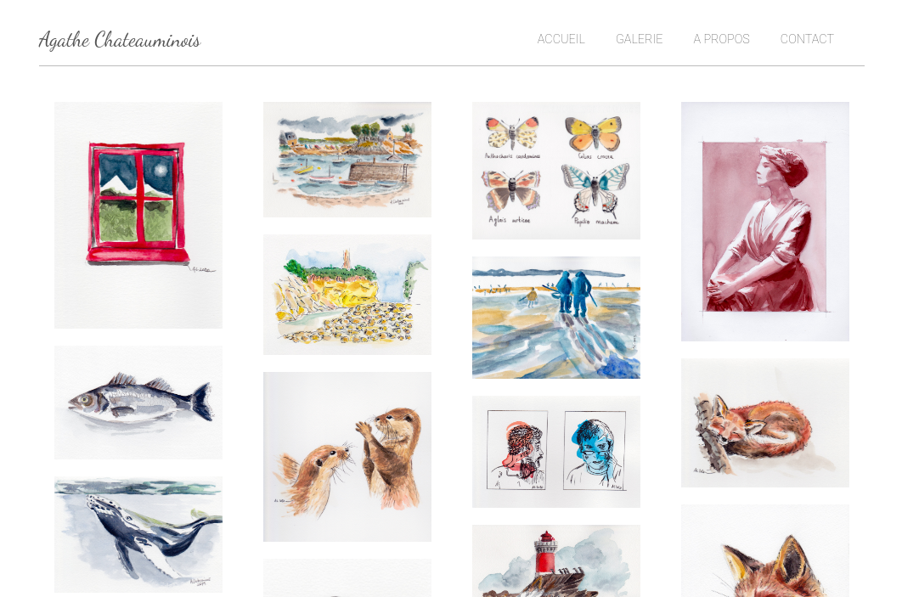

# Site vitrine d'exposition de peintures aquarelle

Réalisation d'un site web pour une amie afin de lui permettre de mettre en valeur ses peintures.

## Techno

React

## Fonctionalités

### Première version en cours

* Une page Galerie qui expose l'ensemble des aquarelles
* Une ou deux page(s) à propos / contact
* Apparition des peintures au scroll
* Zoom sur une peinture au click
* Lien vers Instagram
* Site responsive

### Deuxième version

* Interface admin pour charger en autonomie les photos
